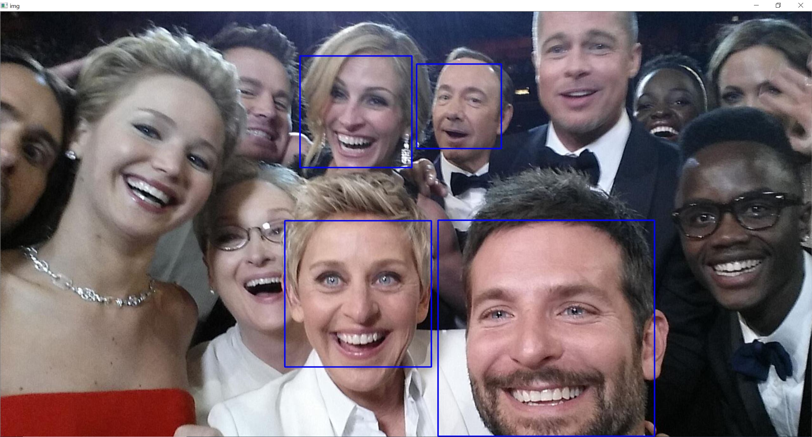

# face_detection
Face detection algorithm using pre-trained haarcascade originally created by Rainer Lienhart. 

## Citation
	Rainer Lienhart and Jochen Maydt. An Extended Set of Haar-like Features for Rapid Object Detection. IEEE ICIP 2002, Vol. 1, pp. 900-903, Sep. 2002. This paper, as well as the extended technical report, can be retrieved at http://www.multimedia-computing.de/mediawiki//images/5/52/MRL-TR-May02-revised-Dec02.pdf
